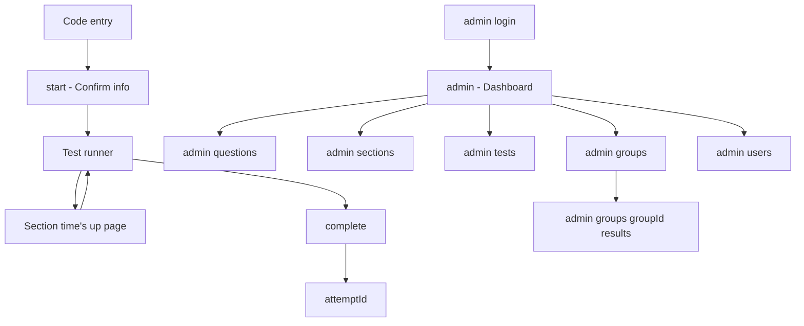
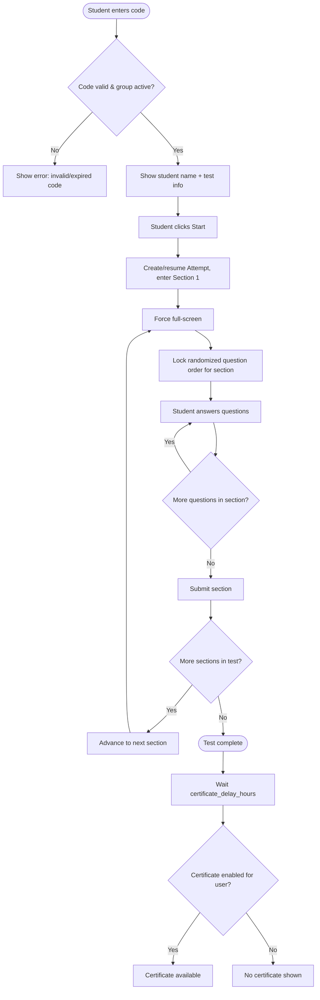
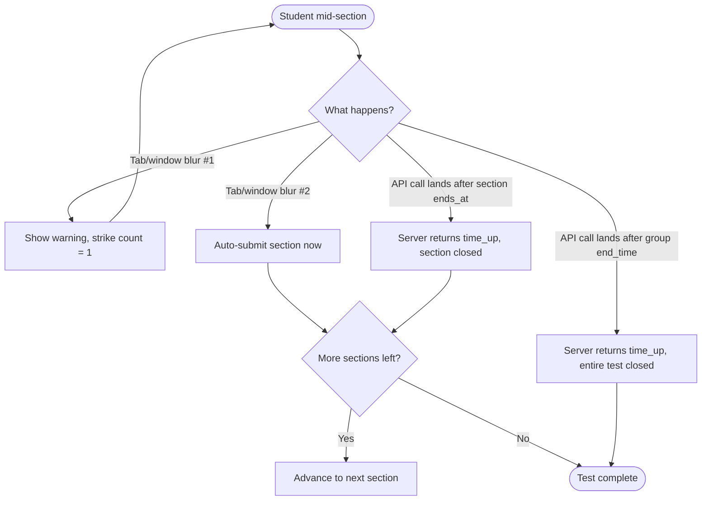
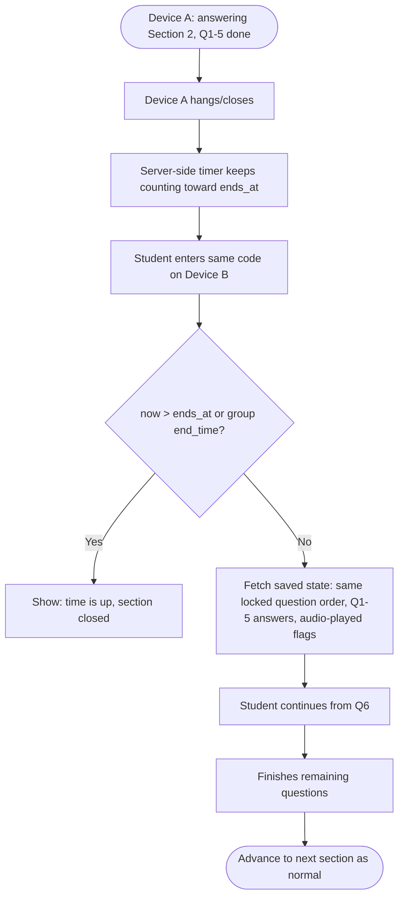
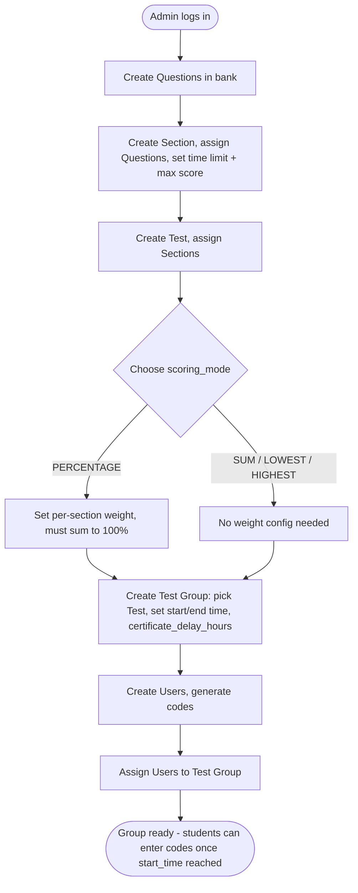

 Online Test Platform — Flow

## Page list

| Page | Role(s) | Purpose | Route (if known) |
|---|---|---|---|
| Code entry | Student | Enter test code | `/` |
| Student info confirm | Student | Show name/test info, "Start" action | `/start` |
| Test runner | Student | Full-screen section-by-section question UI | `/test/[attemptId]` |
| Section finished / time's up | Student | Shown when a section auto-closes (deadline or strikes) | `/test/[attemptId]/section-done` |
| Test complete | Student | Shown after last section submitted | `/test/[attemptId]/complete` |
| Certificate view | Student | Shown once certificate delay has passed (if enabled) | `/certificate/[attemptId]` |
| Admin login | Admin | Email/password login | `/admin/login` |
| Admin dashboard | Admin | Overview — groups, recent attempts | `/admin` |
| Question bank | Admin | Create/edit Questions | `/admin/questions` |
| Section management | Admin | Create/edit Sections, assign Questions | `/admin/sections` |
| Test management | Admin | Create/edit Tests, assign Sections + weights + scoring mode | `/admin/tests` |
| Test group management | Admin | Create/edit Test Groups, schedule, certificate delay | `/admin/groups` |
| Student (User) management | Admin | Create Users, generate codes, assign to groups, toggle certificate flag | `/admin/users` |
| Results / scores view | Admin | Per-group, per-student score breakdown | `/admin/groups/[groupId]/results` |

## Navigation structure

## User flows

### Flow: Student takes a test (happy path, single device)
Triggered when a student enters their code within the Test Group's active window.

### Flow: Section auto-closes (tab-switch strikes or timeout)
Two independent triggers can force-close a section attempt; both lead to the same outcome.

### Flow: Resume on a different device mid-section
Section timer keeps counting server-side throughout, regardless of device state.

### Flow: Admin creates and schedules a test
End-to-end authoring path from question bank to a runnable group.

## Wireframe-level notes

- Test runner page is the most layout-critical screen: needs a visible (but not anxiety-inducing) countdown derived from the server `ends_at`, a question area, and an audio player for listening questions that visually shows "play" before use and a disabled/used state after — no scrub bar, no replay.
- Full-screen enforcement and exit-detection are page-level behaviors on the Test runner route specifically — not global to the app.
- Section "time's up" and "test complete" are deliberately separate pages from the runner itself, so there's a clear state boundary between "actively timed" and "no longer timed."
