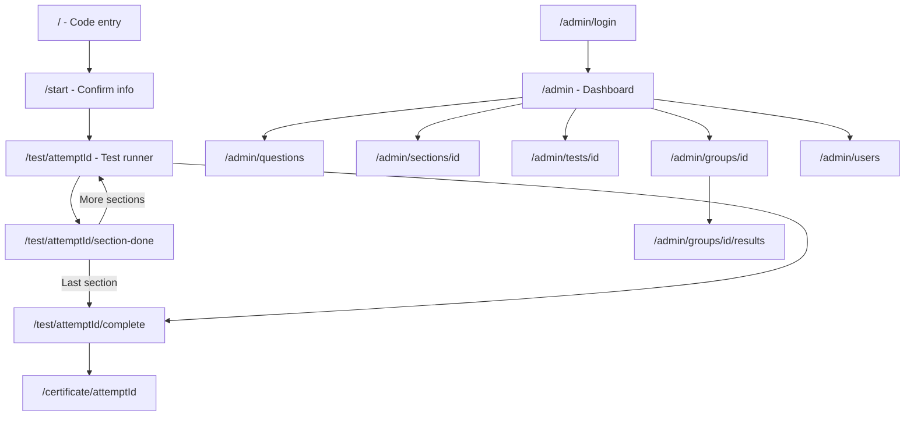
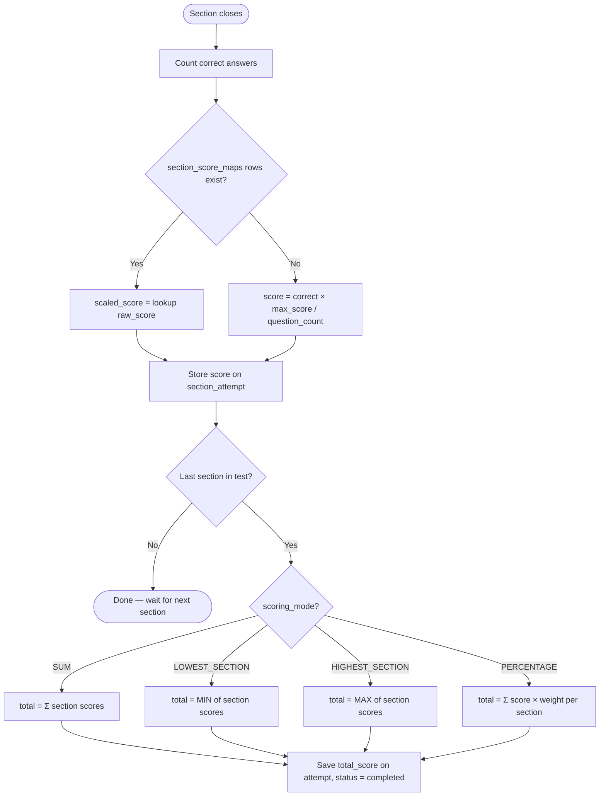
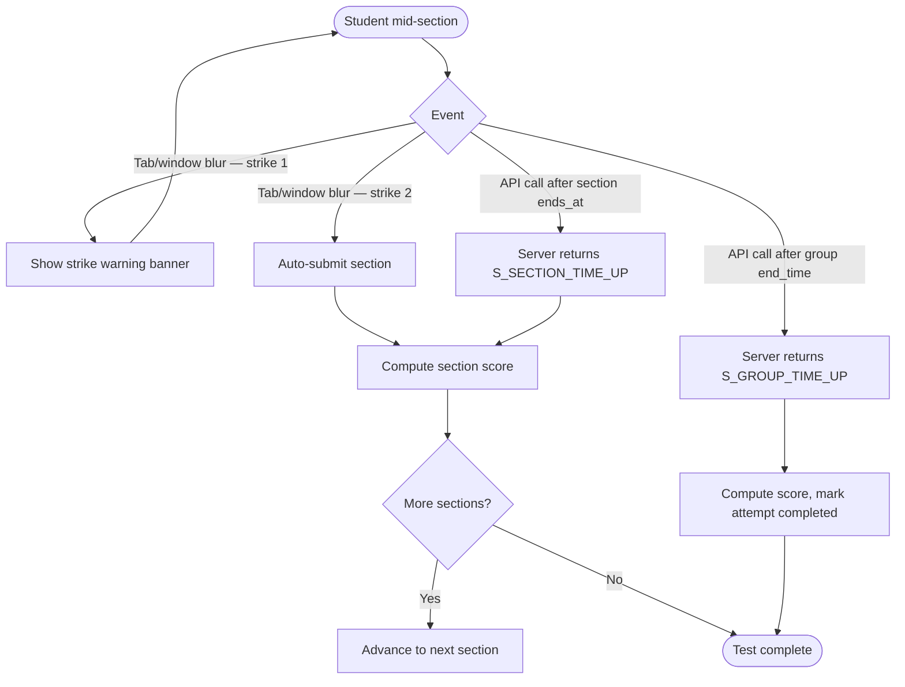
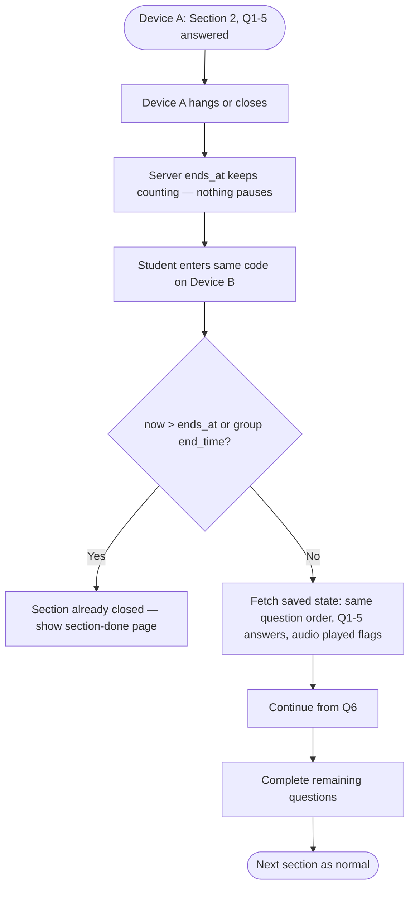
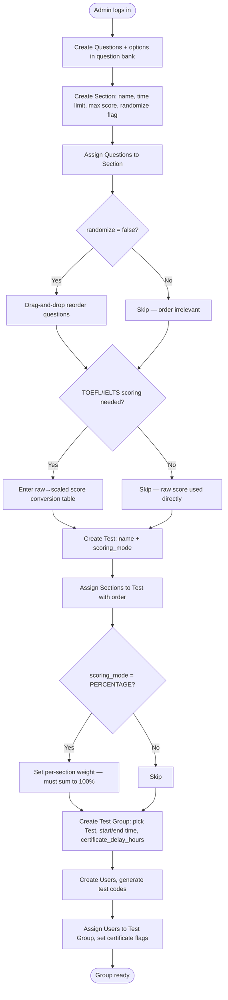

# [PROJECT NAME] — Flow

## Page list

| Page | Role | Purpose | Route |
|---|---|---|---|
| Code entry | Student | Enter test code | `/` |
| Student info confirm | Student | Show name/test info, Start action | `/start` |
| Test runner | Student | Full-screen section-by-section question UI | `/test/[attemptId]` |
| Section done / time's up | Student | Shown when section auto-closes or is submitted | `/test/[attemptId]/section-done` |
| Test complete | Student | Shown after last section submitted | `/test/[attemptId]/complete` |
| Certificate view | Student | Shareable URL, downloadable as PDF | `/certificate/[attemptId]` |
| Admin login | Admin | Email/password login | `/admin/login` |
| Admin dashboard | Admin | Overview — groups, recent attempts | `/admin` |
| Question bank | Admin | Create/edit Questions + options | `/admin/questions` |
| Section management | Admin | Create/edit Sections; assign + reorder Questions; score map | `/admin/sections/[id]` |
| Test management | Admin | Create/edit Tests; assign Sections + weights + scoring mode | `/admin/tests/[id]` |
| Test group management | Admin | Create/edit Groups — schedule, certificate delay, users | `/admin/groups/[id]` |
| Student management | Admin | Create Users, generate codes, assign to groups, certificate flag | `/admin/users` |
| Results view | Admin | Per-group, per-student score + section breakdown | `/admin/groups/[id]/results` |

## Navigation structure



## User flows

### Flow: Student takes a test (happy path, single device)

```mermaid
flowchart TD
    Start([Student enters code]) --> Valid{Code valid & group active?}
    Valid -->|No| Error[Show error: invalid or expired code]
    Valid -->|Yes| ShowInfo[Show student name + test info]
    ShowInfo --> Click[Student clicks Start]
    Click --> CreateAttempt[Create Attempt, enter Section 1]
    CreateAttempt --> Fullscreen[Force full-screen]
    Fullscreen --> RandomizeCheck{randomize_questions?}
    RandomizeCheck -->|Yes| GenOrder[Generate + store locked random question order]
    RandomizeCheck -->|No| UseOrder[Use admin-defined order (creation order)]
    GenOrder --> ShowQ[Show questions]
    UseOrder --> ShowQ
    ShowQ --> Answer[Student selects answer → API call saves it]
    Answer --> MoreQ{More questions?}
    MoreQ -->|Yes| ShowQ
    MoreQ -->|No| SectionSubmit[Submit section → compute + store section score]
    SectionSubmit --> MoreSections{More sections?}
    MoreSections -->|Yes| NextSection[Advance to next section]
    NextSection --> Fullscreen
    MoreSections -->|No| ComputeTotal[Compute total via scoring_mode]
    ComputeTotal --> Done([Test complete page])
    Done --> WaitCert[Wait certificate_delay_hours]
    WaitCert --> CertCheck{Certificate enabled?}
    CertCheck -->|Yes| ShowCert[Certificate available at shareable URL]
    CertCheck -->|No| NoCert[No certificate]
```

### Flow: Section score computation (runs on every section close)



### Flow: Section auto-closes (strikes or timeout)



### Flow: Resume on a different device mid-section



### Flow: Admin creates and schedules a test



## Wireframe-level notes

- **Test runner** has a sticky top bar with timer (`MM:SS`), section name, and section progress pills. Timer color transitions safe → warning → danger, pulses at <30s. Full-screen and tab-switch detection are scoped to this route only.
- **Audio player** has three visual states: `idle` (teal play button active), `playing` (waveform animation, button locked), `done` (greyed out, disabled). State is synced from `audio_plays` table on load — correct state shown immediately on device resume.
- **Answer options** save immediately on selection (no separate submit button per question). The section submit happens at the end (Next on last question) or is forced by the server.
- **Question reorder in admin** is drag-and-drop, visually dimmed/disabled when `randomize_questions = true` to avoid confusion.
- **Score map editor in admin** is a simple inline table (correct answers | scaled score, one row per band) — no file upload needed for phase 1.
- **Certificate** is a styled page at a shareable URL. Download via `html2pdf.js` client-side print. Contains: student name, test name, date taken, score.
- **Section-done and test-complete** pages are separate routes from the runner — clear state boundary between "actively timed" and "done".
